# LinkBox Infrastructure Diagram

## AWS CloudFormation Nested Stack Architecture

```mermaid
graph TB
    subgraph Internet
        Users[End Users]
        GitHub[GitHub Repository]
    end

    subgraph CloudFront["CloudFront Distribution"]
        CF[CloudFront CDN<br/>HTTPS]
        OAI[Origin Access Identity]
    end

    subgraph VPC["VPC (10.20.0.0/16) - linkbox-vpc"]
        IGW[Internet Gateway]
        
        subgraph AZ1["Availability Zone 1"]
            subgraph PubSub1["Public Subnet 1<br/>(10.20.1.0/24)"]
                NAT[NAT Gateway<br/>Single for Cost]
                ALB1[Application Load Balancer<br/>HTTP:80]
            end
            
            subgraph PrivSub1["Private Subnet 1<br/>(10.20.11.0/24)"]
                ASG1[Auto Scaling Group<br/>EC2 Instances<br/>t3.micro]
                RDS1[(RDS PostgreSQL 15<br/>db.t4g.micro<br/>linkbox DB)]
            end
        end
        
        subgraph AZ2["Availability Zone 2"]
            subgraph PubSub2["Public Subnet 2<br/>(10.20.2.0/24)"]
                ALB2[ALB Target]
            end
            
            subgraph PrivSub2["Private Subnet 2<br/>(10.20.12.0/24)"]
                ASG2[Auto Scaling Group<br/>Instances]
            end
        end
        
        subgraph SecurityGroups["Security Groups"]
            ALBSG[ALB Security Group<br/>HTTP:80 from 0.0.0.0/0]
            BackendSG[Backend Security Group<br/>HTTP:80 from ALB SG]
            DBSG[DB Security Group<br/>PostgreSQL:5432 from Backend SG]
        end
        
        subgraph RouteTables["Route Tables"]
            PubRT[Public Route Table<br/>0.0.0.0/0 → IGW]
            PrivRT[Private Route Table<br/>0.0.0.0/0 → NAT Gateway]
        end
    end

    subgraph S3["Amazon S3"]
        FrontendBucket[Frontend Bucket<br/>Static Website<br/>Encrypted]
        UploadsBucket[Uploads Bucket<br/>File Storage<br/>90-day Lifecycle<br/>CORS Enabled]
        ArtifactsBucket[Pipeline Artifacts<br/>30-day Lifecycle<br/>Encrypted]
    end

    subgraph ECR["Amazon ECR"]
        BackendECR[Backend Repository<br/>Docker Images<br/>Image Scanning<br/>Keep Last 10]
    end

    subgraph SSM["Systems Manager"]
        DBParam[SSM Parameter<br/>/linkbox/db-endpoint]
    end

    subgraph CICD["CI/CD Pipeline"]
        CodePipeline[CodePipeline<br/>3 Stages]
        CodeBuild[CodeBuild<br/>Docker Build]
        CodeDeploy[CodeDeploy<br/>EC2 Deployment]
        GitHubWebhook[GitHub Webhook]
    end

    subgraph IAM["IAM Roles & Policies"]
        InstanceRole[EC2 Instance Role<br/>- S3 Access Scoped<br/>- ECR Pull<br/>- CloudWatch Logs<br/>- SSM Parameters]
        CodeBuildRole[CodeBuild Role<br/>- ECR Push<br/>- S3 Artifacts]
        CodeDeployRole[CodeDeploy Role<br/>- EC2/ASG Access<br/>- S3 Artifacts]
        PipelineRole[Pipeline Role<br/>- Orchestration]
    end

    subgraph TargetGroup["Target Group"]
        TG[Health Checks<br/>Path: /health<br/>Interval: 30s<br/>Timeout: 5s]
    end

    %% User Traffic Flow
    Users -->|HTTPS| CF
    CF -->|Static Assets| OAI
    OAI -->|S3 GetObject| FrontendBucket
    CF -->|/api/* requests| ALB1
    
    %% Internet Gateway
    IGW <--> PubRT
    PubRT ---|Associated| PubSub1
    PubRT ---|Associated| PubSub2
    
    %% NAT Gateway (Single)
    NAT <--> PubSub1
    NAT --> IGW
    PrivRT --> NAT
    PrivRT ---|Associated| PrivSub1
    PrivRT ---|Associated| PrivSub2
    
    %% Load Balancer Flow
    ALB1 --> TG
    ALB2 --> TG
    TG -->|Port 80| ASG1
    TG -->|Port 80| ASG2
    
    %% Backend to Services
    ASG1 -->|SQL:5432| RDS1
    ASG2 -->|SQL:5432| RDS1
    ASG1 -->|Read/Write| UploadsBucket
    ASG2 -->|Read/Write| UploadsBucket
    ASG1 -.->|Pull Images| BackendECR
    ASG2 -.->|Pull Images| BackendECR
    ASG1 -.->|Read Config| DBParam
    ASG2 -.->|Read Config| DBParam
    
    %% Security Group Assignments
    ALBSG -.->|Protects| ALB1
    ALBSG -.->|Protects| ALB2
    BackendSG -.->|Protects| ASG1
    BackendSG -.->|Protects| ASG2
    DBSG -.->|Protects| RDS1
    
    %% CI/CD Flow
    GitHub -->|Webhook| GitHubWebhook
    GitHubWebhook --> CodePipeline
    CodePipeline -->|1. Source| GitHub
    CodePipeline -->|2. Build| CodeBuild
    CodeBuild -->|Push Image| BackendECR
    CodeBuild -->|Store Artifacts| ArtifactsBucket
    CodePipeline -->|3. Deploy| CodeDeploy
    CodeDeploy -->|Update Instances| ASG1
    CodeDeploy -->|Update Instances| ASG2
    CodeDeploy -.->|Read Artifacts| ArtifactsBucket
    
    %% IAM Assignments
    InstanceRole -.->|Assumed by| ASG1
    InstanceRole -.->|Assumed by| ASG2
    CodeBuildRole -.->|Used by| CodeBuild
    CodeDeployRole -.->|Used by| CodeDeploy
    PipelineRole -.->|Used by| CodePipeline
    
    %% Styling
    style VPC fill:#e1f5ff
    style AZ1 fill:#fff4e1
    style AZ2 fill:#fff4e1
    style PubSub1 fill:#d4edda
    style PubSub2 fill:#d4edda
    style PrivSub1 fill:#f8d7da
    style PrivSub2 fill:#f8d7da
    style SecurityGroups fill:#e2e3e5
    style IAM fill:#ffeaa7
    style Internet fill:#74b9ff
    style CloudFront fill:#a29bfe
    style S3 fill:#fdcb6e
    style ECR fill:#fd79a8
    style CICD fill:#55efc4
    style SSM fill:#fab1a0
```



---

## 🏗️ Nested Stack Structure

```
main.yml (Master Stack)
│
├─── 01-network.yml      (Network Stack)
│    └── VPC, Subnets, IGW, NAT, Route Tables
│
├─── 02-database.yml     (Database Stack)
│    └── RDS PostgreSQL, Security Group, SSM Parameter
│
├─── 03-backend.yml      (Backend Stack)
│    └── ALB, ASG, EC2, ECR, S3 Uploads, IAM Roles
│
├─── 04-frontend.yml     (Frontend Stack)
│    └── S3 Static Hosting, CloudFront, OAI
│
└─── 05-cicd.yml         (CI/CD Stack)
     └── CodePipeline, CodeBuild, CodeDeploy, GitHub Integration
```

---

## 📋 Component Details

### 1. Network Layer (01-network.yml)

#### VPC Configuration
- **VPC CIDR**: 10.20.0.0/16
- **DNS Support**: Enabled
- **DNS Hostnames**: Enabled
- **Name**: linkbox-vpc

#### Public Subnets
- **Public Subnet 1**: 10.20.1.0/24 (AZ1)
  - Auto-assign public IP enabled
  - Contains: NAT Gateway, Application Load Balancer
  - Tagged: linkbox-public-1
  
- **Public Subnet 2**: 10.20.2.0/24 (AZ2)
  - Auto-assign public IP enabled
  - Contains: Application Load Balancer (Multi-AZ)
  - Tagged: linkbox-public-2

#### Private Subnets
- **Private Subnet 1**: 10.20.11.0/24 (AZ1)
  - Contains: EC2 instances, RDS Database
  - Tagged: linkbox-private-1
  
- **Private Subnet 2**: 10.20.12.0/24 (AZ2)
  - Contains: EC2 instances
  - Tagged: linkbox-private-2

#### Routing
- **Public Route Table**: Routes 0.0.0.0/0 → Internet Gateway
- **Private Route Table**: Routes 0.0.0.0/0 → Single NAT Gateway
  - **Cost Optimization**: Uses single NAT Gateway instead of dual (saves ~$32/month)
  - **Trade-off**: Not HA, but acceptable for learning/development

#### Internet & NAT Gateways
- **Internet Gateway**: Provides internet access for public subnets
- **NAT Gateway**: Single instance in Public Subnet 1 for outbound traffic
- **Elastic IP**: Assigned to NAT Gateway

---

### 2. Database Layer (02-database.yml)

#### RDS PostgreSQL Database
- **Engine**: PostgreSQL 15
- **Instance Class**: db.t4g.micro
- **Storage**: 20GB (encrypted with AES-256)
- **Database Name**: `linkbox` ✅ **Critical Fix**
- **Location**: Private Subnets (Multi-AZ capable)
- **Multi-AZ**: Disabled (cost optimization for learning)
- **Backup Retention**: 7 days
- **Deletion Policy**: Snapshot (data protection)
- **Auto Minor Version Upgrade**: Enabled

#### Database Security
- **Security Group**: linkbox-db-sg
  - **Ingress**: PostgreSQL (5432) from Backend Security Group ✅ **Fixed**
  - **No public access**: Database isolated in private subnets
- **Encryption**: Storage encryption enabled
- **SSL**: Connections can use SSL/TLS

#### SSM Parameter Store ✅ **New Addition**
- **Parameter Name**: `/linkbox/db-endpoint`
- **Type**: String
- **Purpose**: Stores RDS endpoint for EC2 instances to discover
- **Access**: Backend instances read via IAM policy

#### DB Subnet Group
- **Subnets**: Private Subnet 1 & Private Subnet 2
- **Purpose**: Enables Multi-AZ deployment capability

---

### 3. Backend Layer (03-backend.yml)

#### Application Load Balancer (ALB)
- **Type**: Application Load Balancer
- **Scheme**: Internet-facing
- **Subnets**: Public Subnet 1 & 2 (Multi-AZ)
- **Protocol**: HTTP
- **Port**: 80
- **Health Checks**: 
  - Path: `/health`
  - Interval: 30 seconds ✅ **Added**
  - Timeout: 5 seconds ✅ **Added**
  - Healthy threshold: 2 ✅ **Added**
  - Unhealthy threshold: 3 ✅ **Added**
  - Matcher: HTTP 200 ✅ **Added**

#### Auto Scaling Group
- **Instance Type**: t3.micro
- **Min Size**: 1
- **Desired Capacity**: 1
- **Max Size**: 2
- **Subnets**: Private Subnet 1 & 2
- **Launch Template**: Includes UserData for Docker setup
- **Tags**: 
  - Name: linkbox-backend-instance
  - Environment: linkbox
  - Application: backend
  - Project: LinkBox

#### EC2 Instance Configuration
**Software Installed via UserData:**
- Docker (for running backend container)
- CodeDeploy Agent (for CI/CD deployments)
- jq (JSON parsing utility)

**Environment Variables Set:**
- `S3_BUCKET_NAME`: linkbox-uploads
- `DATABASE_URL`: Constructed from SSM parameter

#### ECR Repository ✅ **Managed Resource**
- **Repository Name**: linkbox-backend
- **Image Scanning**: Enabled on push
- **Lifecycle Policy**: Keep last 10 images
- **Purpose**: Store backend Docker images

#### S3 Uploads Bucket ✅ **Critical Addition**
- **Bucket Name**: linkbox-uploads
- **Encryption**: AES-256 enabled
- **CORS**: Enabled for PUT, POST, GET
  - Allows browser uploads from CloudFront
- **Lifecycle Policy**: Delete objects after 90 days
- **Public Access**: Blocked (all 4 settings)
- **Purpose**: Store user-uploaded files

#### Security Groups

**1. ALB Security Group** (linkbox-alb-sg)
- **Ingress**: HTTP (80) from 0.0.0.0/0 ✅ **Configured**
- **Purpose**: Allow internet traffic to load balancer

**2. Backend Security Group** (linkbox-backend-sg) ✅ **Critical Fix**
- **Ingress**: HTTP (80) from ALB Security Group only
- **Egress**: Default (all traffic)
- **Purpose**: Only allow traffic from load balancer

**3. Backend-to-DB Ingress Rule** ✅ **Critical Addition**
- **Type**: SecurityGroupIngress (added to DB security group)
- **Port**: 5432 (PostgreSQL)
- **Source**: Backend Security Group
- **Purpose**: Allow backend instances to connect to database

#### IAM Configuration ✅ **Completely Refactored**

**Instance Role Policies (Least Privilege):**

1. **S3Access** - Scoped to uploads bucket only
   ```yaml
   Resource: 
     - arn:aws:s3:::linkbox-uploads
     - arn:aws:s3:::linkbox-uploads/*
   Actions: PutObject, GetObject, DeleteObject, ListBucket
   ```

2. **CloudWatchLogs** - Scoped to linkbox log groups
   ```yaml
   Resource: arn:aws:logs:*:*:log-group:/aws/linkbox/*
   Actions: CreateLogGroup, CreateLogStream, PutLogEvents
   ```

3. **ECRAccess** - Scoped to specific repository
   ```yaml
   Resource: arn:aws:ecr:*:*:repository/linkbox-backend
   Actions: BatchCheckLayerAvailability, GetDownloadUrlForLayer, BatchGetImage
   Note: GetAuthorizationToken requires Resource: '*' (AWS requirement)
   ```

4. **SSMParameterAccess** ✅ **New Policy**
   ```yaml
   Resource: arn:aws:ssm:*:*:parameter/linkbox/*
   Actions: GetParameter, GetParameters
   ```

5. **EC2TaggingAccess**
   ```yaml
   Resource: '*' (Required for instance metadata operations)
   Actions: CreateTags, DescribeInstances
   ```

---

### 4. Frontend Layer (04-frontend.yml)

#### S3 Static Website Bucket
- **Bucket Name**: Auto-generated (linkbox-frontend-*)
- **Purpose**: Host React/Vue frontend static files
- **Encryption**: AES-256 enabled
- **Versioning**: Enabled
- **Public Access**: Blocked (served via CloudFront only)

#### CloudFront Distribution
- **Default Root Object**: index.html
- **Price Class**: PriceClass_100 (US, Canada, Europe)
- **SSL/TLS**: HTTPS enforced (redirect HTTP to HTTPS)

**Origins:**
1. **S3 Origin** - Frontend static files
   - Domain: S3 bucket regional domain
   - Access: Via Origin Access Identity (OAI)
   - Note: OAI is legacy; OAC recommended for production

2. **ALB Origin** - Backend API
   - Domain: ALB DNS name
   - Protocol: HTTP only (no TLS to backend)

**Cache Behaviors:**

1. **Default Behavior** (Static Assets)
   - Target: S3 Origin
   - Methods: GET, HEAD
   - Compression: Enabled ✅ **Added**
   - Caching: Default CloudFront caching
   - Note: Using ForwardedValues (legacy, works for learning)

2. **API Behavior** (/api/*)
   - Target: ALB Origin
   - Methods: All HTTP methods
   - Caching: Disabled (TTL: 0) ✅ **Fixed**
   - Headers: Forward all
   - Query Strings: Forward all

**Custom Error Responses** ✅ **Critical for SPA**
- **404 Errors** → Return 200 with /index.html
- **403 Errors** → Return 200 with /index.html
- **Purpose**: Enable client-side routing (React Router, Vue Router)
- **Cache TTL**: 300 seconds

#### Origin Access Identity (OAI)
- **Purpose**: Allow CloudFront to access S3 bucket
- **S3 Bucket Policy**: Grants s3:GetObject to CloudFront service
- **Security**: Prevents direct S3 access

---

### 5. CI/CD Layer (05-cicd.yml)

#### CodePipeline
- **Name**: linkbox-backend-pipeline
- **Stages**: 3 (Source → Build → Deploy)

**Stage 1: Source**
- **Provider**: GitHub (OAuth V1)
- **Trigger**: Webhook on push to main branch
- **Note**: V1 is legacy; V2 with CodeStar recommended for production
- **Output**: Source code artifact

**Stage 2: Build**
- **Provider**: CodeBuild
- **BuildSpec**: cicd/buildspec-backend.yml
- **Actions**:
  1. Login to ECR
  2. Build Docker image from backend/
  3. Tag with Git commit hash
  4. Push to ECR repository
  5. Create imagedefinitions.json
- **Output**: Build artifact (includes appspec.yml, scripts)

**Stage 3: Deploy**
- **Provider**: CodeDeploy
- **Deployment Group**: linkbox-backend-deployment-group
- **Target**: Auto Scaling Group instances
- **Strategy**: AllAtOnce (for simplicity)
- **Actions**: Execute deployment scripts on EC2 instances

#### CodeBuild Project
- **Name**: linkbox-backend-build
- **Environment**: Amazon Linux 2 (standard 5.0)
- **Compute**: BUILD_GENERAL1_MEDIUM
- **Privileged Mode**: True (required for Docker)
- **Environment Variables**: ✅ **Added**
  - AWS_DEFAULT_REGION
  - AWS_ACCOUNT_ID
  - IMAGE_REPO_NAME

#### CodeDeploy Application
- **Name**: linkbox-backend-app
- **Compute Platform**: Server (EC2/On-premises)
- **Deployment Config**: AllAtOnce

#### GitHub Webhook
- **Type**: CodePipeline Webhook
- **Authentication**: GITHUB_HMAC
- **Filter**: refs/heads/main
- **Purpose**: Trigger pipeline on git push

#### S3 Artifacts Bucket ✅ **Enhanced**
- **Bucket Name**: linkbox-pipeline-artifacts-{AccountId}
- **Encryption**: AES-256 enabled ✅ **Added**
- **Versioning**: Enabled
- **Lifecycle Policy**: Delete after 30 days ✅ **Added**
- **Purpose**: Store pipeline artifacts between stages

#### IAM Roles ✅ **Permissions Fixed**

**1. CodeBuild Role**
- CloudWatch Logs (scoped to /aws/codebuild/*)
- S3 Artifacts access (read/write)
- ECR access (push images, get auth token)

**2. CodeDeploy Role** ✅ **S3 Access Added**
- AWS Managed: AWSCodeDeployRole
- EC2/ASG access for deployments
- S3 Artifacts access (read) ✅ **Critical Fix**

**3. CodePipeline Role**
- S3 Artifacts access (read/write/list)
- CodeBuild access (start builds, get status)
- CodeDeploy access (create deployments, get status)

---

## 🔄 Traffic Flows

### 1. End-User Web Request Flow
```
1. User → https://<cloudfront-domain>
2. CloudFront CDN (SSL/TLS termination)
3. Route based on path:
   
   Static Assets (/*, /assets/*, etc.):
   └→ CloudFront → OAI → S3 Bucket → Cached → Return to user
   
   API Requests (/api/*):
   └→ CloudFront → ALB (HTTP) → Target Group → Healthy EC2 Instance
      └→ Backend App (Docker) → RDS PostgreSQL → Response
```

### 2. File Upload Flow
```
1. Frontend requests presigned POST URL from backend
2. Backend generates presigned URL using IAM role
3. Frontend uploads file directly to S3 (CORS enabled)
4. Backend stores metadata in RDS
5. Download URL provided (via CloudFront or S3)
```

### 3. CI/CD Deployment Flow
```
1. Developer pushes to GitHub (main branch)
2. GitHub Webhook triggers CodePipeline
3. CodePipeline - Source Stage:
   └→ Pull latest code from GitHub
4. CodePipeline - Build Stage:
   └→ CodeBuild pulls code
   └→ Build Docker image
   └→ Push to ECR
   └→ Store artifacts in S3
5. CodePipeline - Deploy Stage:
   └→ CodeDeploy retrieves artifacts
   └→ Execute scripts on EC2 instances:
      - Stop old Docker container
      - Pull new image from ECR
      - Start new Docker container
6. ALB health checks verify deployment
7. Traffic flows to updated instances
```

### 4. Backend Instance Initialization Flow
```
1. ASG launches EC2 instance in private subnet
2. UserData script executes:
   └→ Install Docker
   └→ Install CodeDeploy agent
   └→ Install utilities (jq)
   └→ Read DB endpoint from SSM Parameter Store
   └→ Export environment variables
   └→ Tag instance for CodeDeploy
3. Instance registers with Target Group
4. Health checks pass (/health endpoint)
5. ALB routes traffic to instance
```

### 5. Database Connection Flow
```
1. Backend instance reads /linkbox/db-endpoint from SSM
2. Constructs DATABASE_URL with credentials
3. Connects to RDS PostgreSQL on port 5432
4. Security group allows connection (Backend SG → DB SG)
5. Connection established over private network
```

### 6. Outbound Internet Access Flow
```
1. EC2 instance in private subnet needs internet (yum update, ECR pull)
2. Traffic routes to Private Route Table
3. Private Route Table sends to NAT Gateway (in Public Subnet 1)
4. NAT Gateway translates to its public IP
5. Traffic routes through Internet Gateway
6. Response flows back through same path
```

---

## 🔐 Security Features

### Network Security
✅ **Defense in Depth**
- Public/Private subnet separation
- Internet Gateway for public subnets only
- NAT Gateway for controlled outbound access
- No direct internet access to EC2 or RDS

✅ **Security Groups (Stateful)**
- ALB: HTTP from internet (0.0.0.0/0)
- Backend: HTTP from ALB only (security group reference)
- Database: PostgreSQL from Backend only (security group reference)
- Principle: Least privilege, deny by default

### Data Security
✅ **Encryption at Rest**
- RDS: Storage encrypted (AES-256)
- S3 Uploads Bucket: Server-side encryption (AES-256)
- S3 Frontend Bucket: Server-side encryption (AES-256)
- S3 Artifacts Bucket: Server-side encryption (AES-256)

✅ **Encryption in Transit**
- CloudFront to users: HTTPS enforced
- CloudFront to ALB: HTTP (private AWS network)
- ALB to EC2: HTTP (VPC internal)
- EC2 to RDS: Can use SSL/TLS
- EC2 to S3: HTTPS (AWS SDK default)

✅ **Secrets Management**
- Database credentials: CloudFormation NoEcho parameters
- GitHub token: CloudFormation NoEcho parameter
- DB endpoint: SSM Parameter Store
- No hardcoded secrets in code

### Access Control
✅ **IAM Least Privilege**
- All policies scoped to specific resources (no wildcards except where required)
- Service-specific roles (EC2, CodeBuild, CodeDeploy, CodePipeline)
- Resource-based policies (S3 bucket policies, ECR policies)

✅ **S3 Bucket Policies**
- Frontend bucket: CloudFront OAI access only
- Uploads bucket: Backend IAM role only
- Artifacts bucket: CodePipeline/CodeBuild/CodeDeploy only
- All buckets: Public access blocked

✅ **Network Isolation**
- RDS: Private subnets only, no public endpoint
- EC2: Private subnets only, no public IPs
- Outbound: Through NAT Gateway only

### Operational Security
✅ **Monitoring & Logging**
- CloudWatch Logs integration
- ALB access logs (can be enabled)
- S3 access logs (can be enabled)
- CloudTrail for API auditing (account-level)

✅ **Resource Tagging**
- Project: LinkBox
- Environment: linkbox
- Name: Descriptive resource names
- Purpose: Cost allocation, access control, audit trails

✅ **Backup & Recovery**
- RDS: Automated backups (7 days)
- RDS: Snapshot on deletion
- S3: Versioning enabled on frontend bucket
- S3: Lifecycle policies for cost optimization

✅ **Image Security**
- ECR: Image scanning on push
- Lifecycle: Keep only last 10 images

---

## 📊 High Availability & Scalability

### Current Design (Learning/Development)
- ⚠️ **Single NAT Gateway**: Cost optimization (saves ~$32/month)
  - Trade-off: AZ1 failure would disrupt outbound internet
- ⚠️ **Single-AZ RDS**: db.t4g.micro instance
  - Trade-off: No automatic failover
- ✅ **Multi-AZ ALB**: Deployed across 2 AZs
- ✅ **Multi-AZ ASG**: Instances distributed across 2 AZs
- ✅ **Auto Scaling**: Automatically adjusts capacity (1-2 instances)

### Production Recommendations
For high availability in production:

1. **Dual NAT Gateways**: One per AZ
   - Cost: +$32/month
   - Benefit: AZ-independent outbound access

2. **Multi-AZ RDS**: Enable Multi-AZ deployment
   - Cost: ~2x RDS cost
   - Benefit: Automatic failover, higher availability

3. **Larger Instances**: Scale up from micro instances
   - Cost: Varies by instance type
   - Benefit: Better performance, handle more traffic

4. **Multiple ASG Instances**: Min: 2, Desired: 2-4, Max: 6+
   - Cost: Linear with instance count
   - Benefit: Redundancy, better fault tolerance

5. **CloudFront**: Already global CDN (✅ Implemented)
   - Benefit: Low latency, DDoS protection

---

## 💰 Cost Breakdown (Estimated Monthly)

| Service | Configuration | Monthly Cost |
|---------|--------------|--------------|
| **VPC & Networking** |
| NAT Gateway | 1 instance + data transfer | ~$32 |
| Elastic IP | 1 for NAT | ~$3.60 |
| **Compute** |
| EC2 (t3.micro) | 1-2 instances, ~730 hours | ~$15-30 |
| Application Load Balancer | 1 ALB, minimal traffic | ~$16 |
| **Database** |
| RDS (db.t4g.micro) | Single-AZ, 20GB storage | ~$15 |
| **Storage** |
| S3 (all buckets) | Minimal storage, low traffic | ~$1-5 |
| **CDN** |
| CloudFront | Low traffic (free tier eligible) | ~$0-5 |
| **Container Registry** |
| ECR | < 10 images | ~$0.50 |
| **CI/CD** |
| CodePipeline | 1 pipeline | Free (first pipeline) |
| CodeBuild | Minimal builds | ~$1-3 |
| CodeDeploy | EC2 deployments | Free |
| **Total** | | **~$84-105/month** |

*Estimates based on us-east-1 pricing, subject to actual usage*

---

## 📚 Learning Points

### CloudFormation Patterns
1. ✅ **Nested Stacks**: Modular, reusable infrastructure components
2. ✅ **Cross-Stack References**: Using Exports/Imports for loose coupling
3. ✅ **Parameter Store Integration**: Runtime configuration discovery
4. ✅ **IAM Least Privilege**: Resource-scoped policies
5. ✅ **Security Group Referencing**: Using SG IDs instead of CIDR blocks

### AWS Best Practices
1. ✅ **Multi-AZ Deployment**: For ALB and ASG
2. ✅ **Private Subnets**: For compute and database layers
3. ✅ **Encryption**: At rest and in transit
4. ✅ **Lifecycle Policies**: Cost optimization
5. ✅ **Health Checks**: Application-aware routing
6. ✅ **Auto Scaling**: Automatic capacity management
7. ✅ **Managed Services**: RDS, ALB, CloudFront, ECR

### DevOps Patterns
1. ✅ **Infrastructure as Code**: Everything in CloudFormation
2. ✅ **CI/CD Automation**: Full pipeline from commit to production
3. ✅ **Immutable Infrastructure**: Docker containers, not config management
4. ✅ **Blue-Green Capable**: CodeDeploy supports multiple strategies
5. ✅ **Monitoring Integration**: CloudWatch Logs

### Trade-offs Made (Learning vs Production)
| Aspect | Current | Production |
|--------|---------|-----------|
| NAT Gateway | Single | Dual (Multi-AZ) |
| RDS | Single-AZ | Multi-AZ |
| Instances | t3.micro | Larger (t3.medium+) |
| ALB | HTTP only | HTTPS with ACM |
| Domain | ALB/CloudFront DNS | Custom domain (Route53) |
| GitHub Integration | OAuth V1 | CodeStar V2 |
| CloudFront Access | OAI (legacy) | OAC (modern) |

---

## 🛠️ Deployment Commands

### Quick Deploy
```bash
cd infrastructure

# Get latest AMI ID
./get-ami-id.sh

# Deploy everything
./deploy.sh \
  linkbox-cfn-templates \
  linkbox-master \
  ami-091d7d61336a4c68f \
  your-username/repo-name \
  ghp_your_github_token
```

### Manual Validation
```bash
# Validate templates
aws cloudformation validate-template --template-body file://main.yml
aws cloudformation validate-template --template-body file://01-network.yml
aws cloudformation validate-template --template-body file://02-database.yml
aws cloudformation validate-template --template-body file://03-backend.yml
aws cloudformation validate-template --template-body file://04-frontend.yml
aws cloudformation validate-template --template-body file://05-cicd.yml

# Upload to S3
aws s3 sync infrastructure/ s3://linkbox-cfn-templates/ \
  --exclude "*" --include "*.yml" --exclude "main.yml"

# Deploy
aws cloudformation create-stack \
  --stack-name linkbox-master \
  --template-body file://main.yml \
  --parameters file://parameters.json \
  --capabilities CAPABILITY_IAM
```

---

## 🐛 Troubleshooting Guide

### Health Check Failures
```bash
# Check instance health
aws elbv2 describe-target-health \
  --target-group-arn <target-group-arn>

# Check application logs
aws logs tail /aws/linkbox/backend --follow

# SSH to instance (if needed)
aws ssm start-session --target <instance-id>
```

### Database Connection Issues
```bash
# Verify SSM parameter
aws ssm get-parameter --name /linkbox/db-endpoint

# Check security group rules
aws ec2 describe-security-groups \
  --group-ids <db-sg-id> <backend-sg-id>

# Test connection from instance
aws ssm send-command \
  --instance-ids <instance-id> \
  --document-name "AWS-RunShellScript" \
  --parameters 'commands=["nc -zv <db-endpoint> 5432"]'
```

### CI/CD Pipeline Failures
```bash
# Check pipeline status
aws codepipeline get-pipeline-state --name linkbox-backend-pipeline

# Check CodeBuild logs
aws logs tail /aws/codebuild/linkbox-backend-build --follow

# Check CodeDeploy deployment
aws deploy list-deployments --application-name linkbox-backend-app
aws deploy get-deployment --deployment-id <id>
```

---

## 📖 Related Documentation

- **infrastructure/README.md** - Deployment guide
- **infrastructure/INFRASTRUCTURE-FIXES.md** - Detailed changes and security improvements
- **CICD-SETUP.md** - CI/CD configuration details
- **backend/README.md** - Backend application setup
- **frontend/README.md** - Frontend application setup

---

**Infrastructure Status**: ✅ Production-Ready (with noted learning trade-offs)  
**Last Updated**: Post-security review and fixes  
**CloudFormation Validated**: ✅ All templates pass validation
