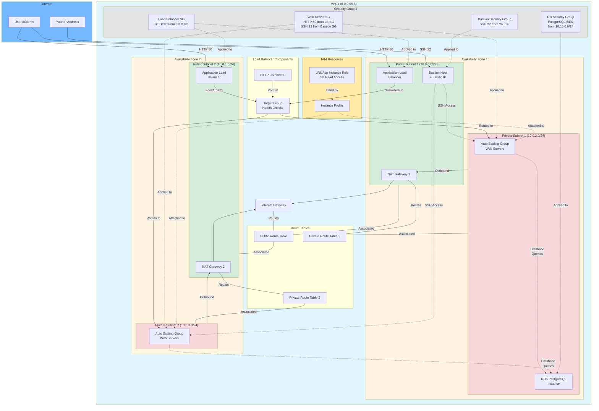

# Infrastructure Diagram

## AWS CloudFormation Infrastructure Architecture

## Component Details

### Network Layer (network.yml)

#### VPC Configuration
- **VPC CIDR**: 10.0.0.0/16
- **DNS Support**: Enabled
- **DNS Hostnames**: Enabled

#### Public Subnets
- **Public Subnet 1**: 10.0.0.0/24 (AZ1)
  - Auto-assign public IP enabled
  - Contains: NAT Gateway 1, Bastion Host, Load Balancer
- **Public Subnet 2**: 10.0.1.0/24 (AZ2)
  - Auto-assign public IP enabled
  - Contains: NAT Gateway 2, Load Balancer

#### Private Subnets
- **Private Subnet 1**: 10.0.2.0/24 (AZ1)
  - Contains: Web Server instances, RDS Database
- **Private Subnet 2**: 10.0.3.0/24 (AZ2)
  - Contains: Web Server instances

#### Routing
- **Public Route Table**: Routes 0.0.0.0/0 → Internet Gateway
- **Private Route Table 1**: Routes 0.0.0.0/0 → NAT Gateway 1
- **Private Route Table 2**: Routes 0.0.0.0/0 → NAT Gateway 2

### Compute Layer (servers.yml)

#### Bastion Host
- **Instance Type**: t2.micro
- **AMI**: ami-0557a15b87f6559cf
- **Location**: Public Subnet 1
- **Access**: SSH from specified IP address only
- **Elastic IP**: Assigned for consistent access

#### Auto Scaling Group
- **Instance Type**: t2.micro
- **AMI**: ami-0557a15b87f6559cf
- **Min Size**: 1 (configurable)
- **Desired Capacity**: 1 (configurable)
- **Max Size**: 3 (configurable)
- **Location**: Private Subnets (both AZs)
- **Software**: Nginx web server
- **Storage**: 10GB EBS volume

#### Application Load Balancer
- **Type**: Application Load Balancer (ALB)
- **Scheme**: Internet-facing
- **Location**: Public Subnets (both AZs)
- **Protocol**: HTTP
- **Port**: 80
- **Health Checks**: Every 10 seconds on path "/"

#### Security Groups
1. **Bastion Security Group**
   - Ingress: SSH (22) from your IP only
   - Egress: All TCP (0-65535) to 0.0.0.0/0

2. **Load Balancer Security Group**
   - Ingress: HTTP (80) from 0.0.0.0/0
   - Egress: Default

3. **Web Server Security Group**
   - Ingress: 
     - HTTP (80) from Load Balancer Security Group
     - SSH (22) from Bastion Security Group
   - Egress: All TCP (0-65535) to 0.0.0.0/0

#### IAM Configuration
- **Role**: WebApp Instance Role
  - Allows EC2 to assume role
  - Policy: S3 GetObject access to website-bucket/*
- **Instance Profile**: Attached to web server instances

### Storage Layer (db.yaml)

#### RDS PostgreSQL Database
- **Engine**: PostgreSQL 15.2
- **Instance Class**: db.t3.micro
- **Storage**: 20GB
- **High Availability**: Multi-AZ capable (using DB Subnet Group)
- **Location**: Private Subnets
- **Database Name**: exampledb
- **Deletion Policy**: Snapshot
- **Auto Minor Version Upgrade**: Enabled

#### Database Security Group
- **Ingress**: PostgreSQL (5432) from 10.10.0.0/24
- **Purpose**: Restricts database access to application network

#### Database Configuration
- **Parameter Group**: Custom (postgres15)
  - synchronous_commit: off (for performance)
  - rds.force_ssl: 1 (requires SSL connections)
- **Subnet Group**: Spans both private subnets for high availability

## Traffic Flow

### External User Request Flow
1. User sends HTTP request to Load Balancer DNS
2. Request hits ALB in public subnet
3. ALB forwards to Target Group
4. Target Group distributes to healthy web servers in private subnets
5. Web servers process request (may query RDS database)
6. Response flows back through ALB to user

### SSH Access Flow (via Bastion)
1. Administrator connects to Bastion Host via SSH (from allowed IP)
2. From Bastion, can SSH to web servers in private subnets
3. Provides secure access to private instances

### Web Server Outbound Flow
1. Web servers in private subnets need internet access (updates, etc.)
2. Traffic routes through NAT Gateway in respective AZ
3. NAT Gateway routes through Internet Gateway
4. Maintains security by not exposing servers directly

### Database Access Flow
1. Web servers query RDS database on port 5432
2. Database resides in private subnets (multi-AZ capable)
3. Access controlled by DB security group
4. SSL encryption enforced

## High Availability Features

- **Multi-AZ Deployment**: Resources distributed across 2 availability zones
- **Redundant NAT Gateways**: One per AZ for failover
- **Auto Scaling**: Automatically adjusts capacity based on demand
- **Load Balancing**: Distributes traffic and performs health checks
- **Database Snapshots**: Automatic snapshot on deletion
- **Elastic IP**: Ensures consistent Bastion Host access point

## Security Features

- **Network Segmentation**: Public/private subnet separation
- **Security Groups**: Least-privilege access control
- **Bastion Host**: Controlled SSH access to private resources
- **NAT Gateways**: Outbound-only internet for private subnets
- **IAM Roles**: Service-specific permissions (S3 read-only)
- **Database Security**: Restricted access, SSL enforcement
- **Private Subnets**: Web servers and database not directly internet-accessible

