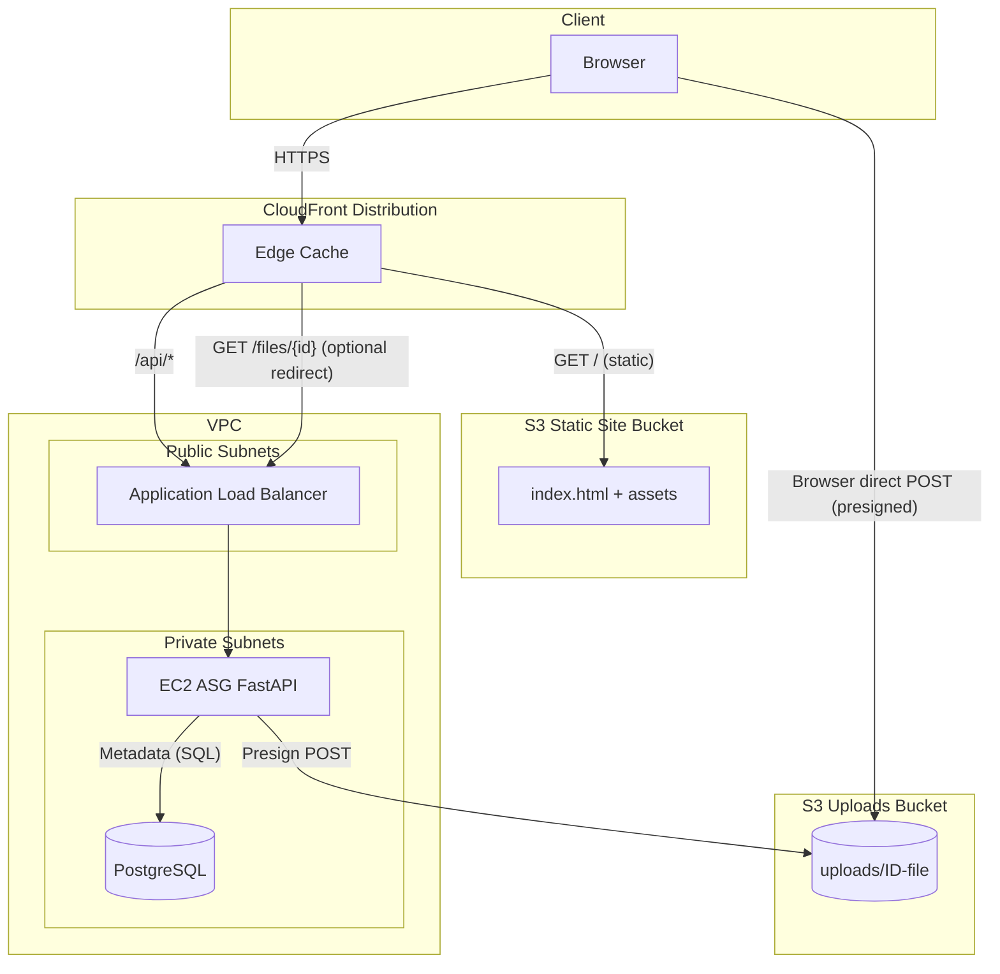

# LinkBox Infrastructure Diagram (Mermaid)

Legend:
- Presigned upload: Browser POSTs directly to S3 using form fields from backend.
- ASG container only touches metadata, not file payload.
- CloudFront provides two behaviors: static (default) & /api/* (ALB origin).
